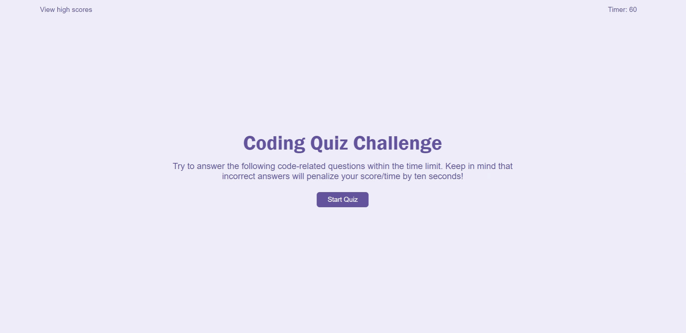
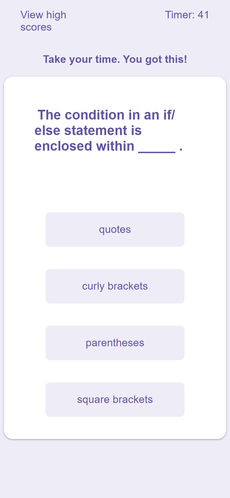

# quiz-app

## Demo 
https://ken862734801.github.io/quiz-app/

## Preview

View on mobile

## Summary

The goal of this assignment was to complete a quiz app with web API's based on the template given to us. 

Looking back on this assignment, I feel as though more psuedocode and planning code have helped me avoid some of the headaches I came across. Laying out a flow for the quiz before hand would have made this alot easier. There are still some bugs that occur when the user answers too fast that I plan to come back and address but for now I am pleased with the result. This was also my first time implementing local storage, and it was a little rough. Now looking back on it, it really is as simple as "setting" and "getting" an object but I neglected to stringify the JSON, and that could have been avoided if I went through the documentation. I also used the setInterval function for the first time but that was relatively straight forward. 

### Features
- Deduct points for wrong answers.
- Local storage to record the user's initials and score.
- Mobile responsive.
- Randomized feedback depending on if the answer is correct or not.